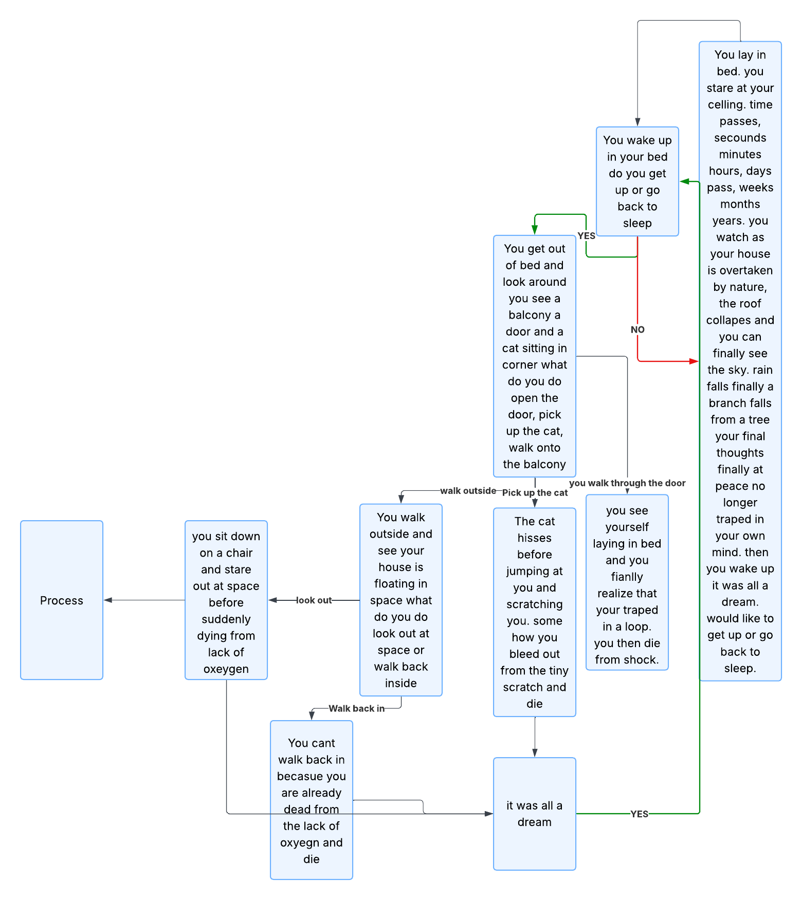

# Brody Barnes's Life Decision Game

This is a game where you live out a short few moments of someones life where **your choices matter**.

## Requirements
Python 3

## Installation
go to [_decision_tree.py_](https://github.com/WTCSC/life-decision-simulator-ltl902/blob/main/decision_tree.py) and install the file.

## How to play
Type this command into your terminal
```sql 
cd "file path to decision_tree.py" | python3 decision_tree.py
```
Then follow the instructions the game gives you
## Testing
Run the code if it throws an **error** make sure you followed the installation and how to play sections correctly

## Flow Chart
You can view the flow chart for the game [here](https://lucid.app/lucidchart/1580b195-51d5-48d9-b02d-8fc28af11b91/edit?viewport_loc=-3798%2C-674%2C4707%2C2539%2C0_0&invitationId=inv_3239e3fc-f47b-4b2a-8577-daa120d1cca2) or below


## Code Highlights
```python
import time
def type_out(text, delay=0.05):
    for char in text:
        print(char, end='', flush=True)
        time.sleep(delay)
```